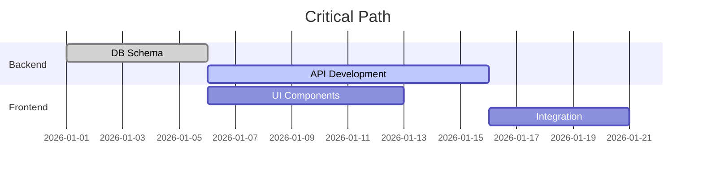

# /soc-plan

## 1. Command Overview

The `/soc-plan` command bridges the gap between **brainstorming** (ideas) and **design** (architecture). It transforms high-level requirements into actionable sprints, milestones, and dependency trees. It is the "Project Navigator" that ensures the right work happens in the right order.

## 2. Triggers & Routing

The command activates specific planning modes based on project phase and scope.

| Trigger Scenario | Flag | Target Agent | Context Injected |
| :--- | :--- | :--- | :--- |
| **Sprint Planning** | `--mode sprint` | `[pm-agent]` | User Stories, Capacity, Velocity |
| **Roadmap Creation** | `--mode roadmap` | `[pm-agent]` + `[architect]` | Quarterly Goals, Tech Debt |
| **Milestone Tracking** | `--mode milestone` | `[pm-agent]` | Critical Path, Blockers |
| **Dependency Analysis** | `--mode dependencies` | `[architect]` | Service Dependencies, APIs |

## 3. Usage & Arguments

```bash
/soc-plan [scope] [flags]
```

### Arguments

- **`[scope]`**: The planning scope (e.g., "Q1 2026 Features", "User Auth Epic", "v2.0 Release").

### Flags

- **`--mode [sprint|roadmap|milestone|dependencies]`**: **MANDATORY**. Specifies the planning granularity.
- **`--duration [weeks]`**: Sprint/roadmap duration (default: 2 weeks for sprint, 12 weeks for roadmap).
- **`--capacity [hours]`**: Team capacity in hours for sprint planning.
- **`--priority [must|should|could]`**: Filters tasks by MoSCoW priority.
- **`--output [markdown|json|csv]`**: Output format for the plan (default: markdown).

## 4. Behavioral Flow (Orchestration)

### Phase 1: Context Gathering

1. **Read**: Parse existing `requirements.md`, `task_queue.md`, and `project_status.md`.
2. **Analyze**: Identify completed work, in-progress items, and pending backlog.
3. **Constraint Check**: Review technical constraints from `architect` ADRs.

### Phase 2: Planning Generation

#### For Sprint Mode (`--mode sprint`):
- Break down epics into sprint-sized tasks (≤8 hours each).
- Assign story points using Fibonacci scale.
- Calculate velocity based on historical data.
- Identify dependencies that block sprint completion.

#### For Roadmap Mode (`--mode roadmap`):
- Map epics to quarters/months.
- Align technical milestones with business goals.
- Schedule tech debt reduction sprints.
- Identify hiring/resource needs.

#### For Dependency Mode (`--mode dependencies`):
- Map service-to-service dependencies.
- Identify circular dependencies and coupling.
- Create critical path visualization.
- Flag external API dependencies and SLAs.

### Phase 3: Validation & Output

- **Validate**: Check for overloaded sprints (>100% capacity).
- **Export**: Generate `sprint_plan.md` or `roadmap.md`.
- **Sync**: Update `project_status.md` with new milestones.

## 5. Output Guidelines (The Contract)

### Sprint Plan Template

```markdown
# Sprint Plan: [Sprint Name]

## Overview
**Duration**: [Start Date] - [End Date]  
**Capacity**: [X] hours  
**Velocity**: [Y] story points  
**Goal**: [One-line sprint objective]

## Sprint Backlog

### Must Have (MoSCoW)
| ID | Task | Story Points | Assignee | Dependencies | Status |
|:---|:-----|:------------:|:--------:|:-------------|:------:|
| US-001 | Implement OAuth login | 5 | backend | DB Schema | ⬜ |
| US-002 | Create login UI | 3 | frontend | US-001 API | ⬜ |

### Should Have
| ID | Task | Story Points | Assignee | Dependencies | Status |
|:---|:-----|:------------:|:--------:|:-------------|:------:|
| US-003 | Add password reset | 3 | backend | Email Service | ⬜ |

### Could Have
| ID | Task | Story Points | Assignee | Dependencies | Status |
|:---|:-----|:------------:|:--------:|:-------------|:------:|
| US-004 | Social login buttons | 2 | frontend | US-002 | ⬜ |

## Risks & Blockers
- ⚠️ **BLOCKER**: Waiting for AWS account setup (affects US-001)
- 🟡 **RISK**: Email service API rate limits

## Definition of Done
- [ ] All "Must Have" tasks completed
- [ ] Code reviewed and merged
- [ ] Tests passing (>80% coverage)
- [ ] Documentation updated
```

### Roadmap Template

```markdown
# Product Roadmap: [Project Name]

## Q1 2026: Foundation
- **Theme**: Core Platform & Auth
- **Key Deliverables**:
  - User authentication system
  - Database schema v1
  - CI/CD pipeline
- **Milestone**: Beta Launch (March 15)

## Q2 2026: Growth
- **Theme**: Features & Scale
- **Key Deliverables**:
  - Payment integration
  - Admin dashboard
  - Performance optimization
- **Milestone**: Public Launch (June 1)

## Dependencies Map

```

## 6. Examples

### A. Sprint Planning

```bash
/soc-plan "User Authentication Epic" --mode sprint --duration 2 --capacity 80
```

*Effect:* Creates a 2-week sprint plan with tasks broken down from the auth epic, estimated at 80 hours capacity, with dependency chains identified.

### B. Quarterly Roadmap

```bash
/soc-plan "Q1 2026 Product Roadmap" --mode roadmap --duration 12
```

*Effect:* Generates a 12-week roadmap with monthly milestones, resource allocation, and tech debt sprints scheduled.

### C. Dependency Analysis

```bash
/soc-plan "Microservices Architecture" --mode dependencies
```

*Effect:* Maps all service dependencies, identifies circular dependencies, and creates a critical path diagram.

## 7. Dependencies & Capabilities

### Agents

- **Orchestrator**: `[pm-agent]` - Sprint breakdown, capacity planning, and milestone tracking.
- **Technical Consultant**: `[architect]` - Dependency mapping and technical feasibility.
- **Support**: `[backend]`, `[frontend]` - Effort estimation for implementation tasks.

### Skills

- **Sequential Thinking**: `@[.opencode/skills/sequential-thinking/SKILL.md]` - For dependency tree analysis and critical path calculation.
- **Simplification**: `@[.opencode/skills/simplification/SKILL.md]` - Ensures plans are realistic and not over-committed.
- **Confidence Check**: `@[.opencode/skills/confidence-check/SKILL.md]` - Validates plan feasibility before commitment.

### MCP Integration

- **`sequential-thinking`**: **MANDATORY** for complex dependency mapping.
- **`read_file` / `write_file`**: Updates `project_status.md`, `sprint_plan.md`, `roadmap.md`.
- **`tavily`**: Research industry-standard story point baselines and velocity benchmarks.

## 8. Boundaries

**Will:**

- Create detailed sprint and roadmap documents.
- Calculate capacity and velocity metrics.
- Map dependencies and critical paths.
- Identify risks and blockers.

**Will Not:**

- **Assign Specific People**: Suggests agent types (backend/frontend) but not individual humans.
- **Guarantee Delivery Dates**: Provides estimates with confidence intervals, not promises.
- **Ignore Constraints**: Will flag if requested scope exceeds capacity.
- **Execute Work**: Planning only—use `/soc-implement` for execution.

## User Instruction

The user have executed the `/soc-plan` command by parsing the user's arguments provided in `<user-instruction>$ARGUMENTS</user-instruction>`, then route to the appropriate mode (sprint, roadmap, milestone, or dependencies), read existing project context from `requirements.md`, `task_queue.md`, and `project_status.md`, generate a comprehensive plan document with task breakdowns, estimates, and dependency mapping, validate the plan against capacity constraints and technical feasibility, identify risks and blockers, and output the plan in the requested format while updating `project_status.md` with new milestones and timelines.
